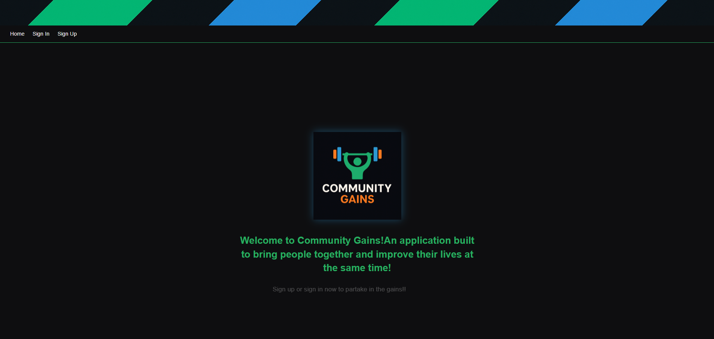
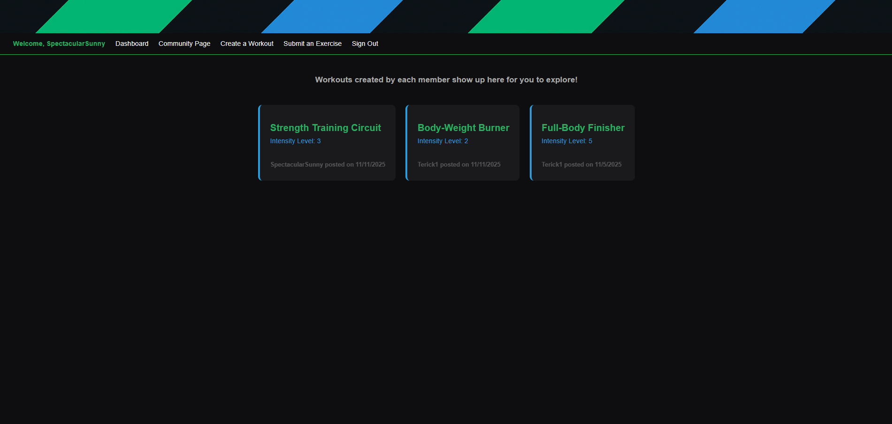
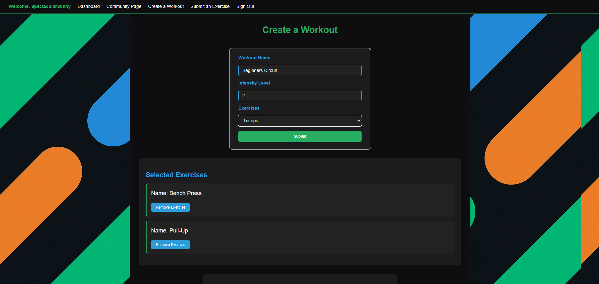

# Community Gains!
Living life can get pretty hard; working a job, maybe taking care of kids, trying to eat healthy. Trying to maintain all these tings by yourself can be overwhelming. I was in the same situation and it led me to develop this Application. This application allows individuals to come together as a community to better their lives by sharing exercises that they've created and completed. 

The application features a personal Dashboard page that dispays all of the Workouts you've created; as well as a Community Page that displays all of the Workouts that were created by each user. 

I made this application because before I enrolled in Full Stack Development Bootcamp, I went to the gym 4-5 times a week. While at the gym I would try out new exercises but hand no organized way to record the tasks I completed that day. This application removes that hassel by providing a platform to record all the exercises completed in a specific Workout.

# Planning
As mentioned earlier, I drew my inspiration from my love for the gym, and the hassel of recording the exercises in a single place without having to pay an arm and a leg. Once I knew what I wanted the planning came pretty easy. The steps I took to plan the development of Application are below:
- 1. I had to define the Schemas for the Workout out itself, the exercises that would be submitted into the database, and the comments that would be used to provide user insight on created Workouts.
- 2. Drafted the wireframes for the application to develop a sense of what I wanted the UI to look like for users. 
- 3. Identified the necessary components need to render each "page" of the application. The Community Page, the Workout Form (the page where user would create Workouts), the Exercise Form (where users would submit exercises to the database) and many more. 
- 4. Completed the Create, Read(index and show), Update, and Delete fucntionalities for the objects associated with both objects.
- 5. Styled the application with SCSS styling language. 

[Community Gains Application](https://communitygains.surge.sh/)

[Community Gains Back End Repo](https://github.com/TeridkMDupont/express-api-workout-back-end)

# Technologies Used
- **React**: React is an open-source JavaScript library primarily used for building user interfaces (UIs) for web and mobile applications.
- **Various React Hooks**: A multitude of React hooks were used for the development of the application such as useState, useEffect, useNavigate, useParams, Link etc. These hooks allowed the the React application to render properly, navigate from one component to another and made the functions more user friendly.
- **JSX**: JSX is short for JavaScript XML, it is a syntax extension for JavaScript that allows developers to write HTML-like code directly within their JavaScript files.
- **MongoDB**: MongoDB is used to manage the database. MongoDB is what stores all the user, Workout, and Exercise information to be retrieved by the front when completing certain tasks.
- **SCSS**: SCSS stands for Sassy Cascading Style Sheets, it is a CSS preprocessor that extends CSS with additional features like variables, nesting, and mixins

# Next Steps
Some of the future enhancements that I would like to encorporate are listed below:
- Currently in the application theres a serperate component for displaying all the Workouts and all the exercises submitted. I want to incorporate a tab function that will allow the user to toggle bewteen diplaying the Workouts or exercises. This will make the application more presentable as well as making it more user friendly. 
- Another enhancement or change would be to allow users to copy/duplicate an existing Workout which would allow them to alter the Workout any way they see fit. 
- Lastly, I would like to add a UOM for each exercise, for example I would add a field that would specify the duration in miles or minutes for running. Another example would be to add weight, reps and sets for an exercise like the Bench Press.

# Previews

